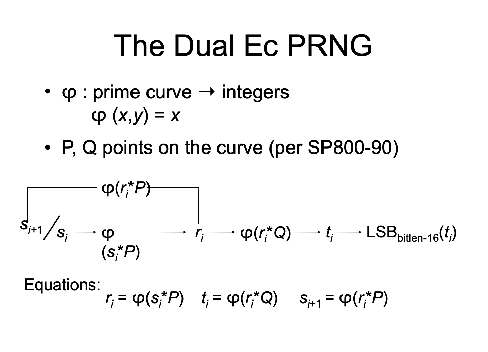
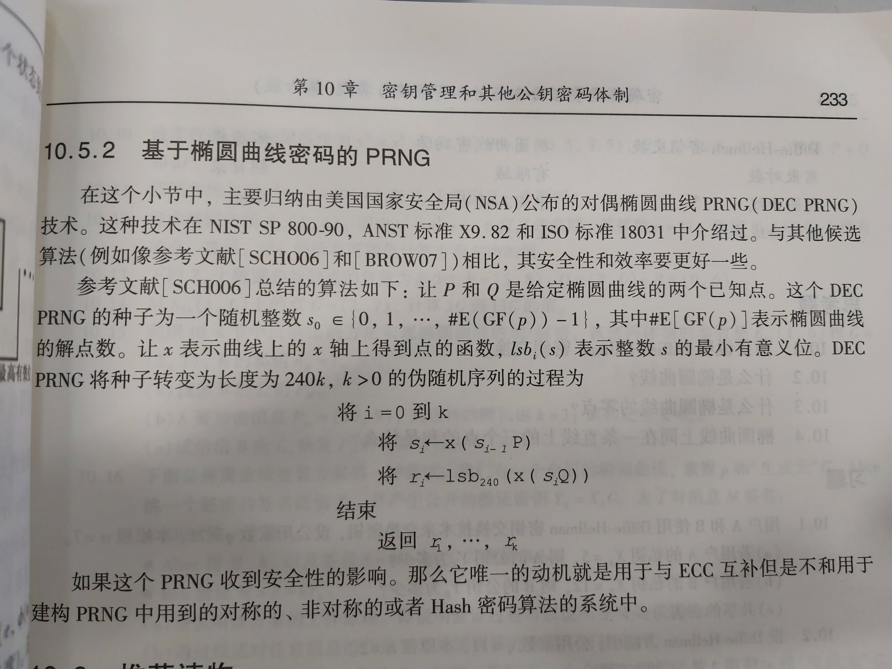

# 密码学考古：伪随机数算法 dual ec prng的后门

> dual ec prng 是基于椭圆曲线上的运算，由 NSA 提出，曾作为标准的伪随机数发生器。后被指出随机数序列有一定偏好；后被指出可能存在后门，攻击者可以根据当前随机数预测将来的随机数；再后来被明确废弃；再后来斯诺登指出曾经NSA和RSA公司之间有py交易。本文从数学原理上仔细分析该伪随机数算法存在的缺陷，使用代码复现攻击的情景，非原创，是将数学论文里描述的内容展示出来。

# 一、背景

网上乱七八糟的新闻新闻多的去了，我就不介绍背景了，搜关键词 `dual_ec_prng` 就有很多报道性的新闻了。作为一个搞技术的，只讲技术，不讲别的，结论是：知道"点P"和"点Q"生成方式的人，有能力通过观测伪随机的片段，预测出将来随机数的内容。

本文的预备知识：椭圆曲线加密（加法、乘法）。

本文根据公开的三分文档编写而成，建议精读第一份文档：

1. 首次提出算法缺陷的文档： [http://rump2007.cr.yp.to/15-shumow.pdf](http://rump2007.cr.yp.to/15-shumow.pdf)
2. NIST 关于缺陷声明：[https://csrc.nist.gov/csrc/media/projects/crypto-standards-development-process/documents/dualec_in_x982_and_sp800-90.pdf](https://csrc.nist.gov/csrc/media/projects/crypto-standards-development-process/documents/dualec_in_x982_and_sp800-90.pdf)
3. NIST 标准：[https://nvlpubs.nist.gov/nistpubs/Legacy/SP/nistspecialpublication800-90a.pdf](https://nvlpubs.nist.gov/nistpubs/Legacy/SP/nistspecialpublication800-90a.pdf)

# 二、伪随机数的原理

`dual_ec_prng` 需要约定一条椭圆曲线，基点，选取约定好的点P，选取约定好的点Q。

官方推出三组参数，并且说可以更换里面的参数，我们选择一组展示一下：

椭圆曲线：使用编号为 `P-256`

基点（G_Point）：
```
Gx = 0x6b17d1f2e12c4247f8bce6e563a440f277037d812deb33a0f4a13945d898c296
Gy = 0x4fe342e2fe1a7f9b8ee7eb4a7c0f9e162bce33576b315ececbb6406837bf51f5
```

秩(Order, n）：
```
n = 0xffffffff00000000ffffffffffffffffbce6faada7179e84f3b9cac2fc632551
```

点P(P_Point)：
```
Px = 6b17d1f2 e12c4247 f8bce6e5 63a440f2 77037d81 2deb33a0 f4a13945 d898c296
Py = 4fe342e2 fe1a7f9b 8ee7eb4a 7c0f9e16 2bce3357 6b315ece cbb64068 37bf51f5
```

点Q(Q_Point)：
```
Qx = c97445f4 5cdef9f0 d3e05e1e 585fc297 235b82b5 be8ff3ef ca67c598 52018192
Qy = b28ef557 ba31dfcb dd21ac46 e2a91e3c 304f44cb 87058ada 2cb81515 1e610046
```

使用方式：输入一个种子，输出伪随机的序列，每次运算可以生成30byte的数据。与平时使用 libc 的 `srand`、`random` 比起来，差别不大。

每次运算过程如图，图来自第一份文档15-shumow.pdf。



我们不讨论如何从种子变成 `si` 的过程，从 `si` 开始向后阅读，流程为：

1. 计算 `si` 乘以 `P_Point`，取结果的x坐标，记为 `ri`。 `ri = (si*P_Point).x`
2. 计算 `ri` 乘以 `Q_Point`，取结果的x坐标，记为 `ti`。 `ti = (ri*Q_Point).x`
3. 对 `ti` 这个256bit 的数字，取低 240bit(30byte)，作为本轮的随机数输出。 
4. 计算 `ri` 乘以 `P_Point`，取结果的x坐标，作为下一轮的 `s(i+1)`。 `s(i+1) = (ri*P_Point).x`

整个流程非常简单，由这三个等式即可描述清楚。

### 随机性分析

因为我并不是专业的密码学大师，只能粗浅的角度来分析，不够严谨。

给一个普通的种子，乘以给定的点P，再取横坐标，可以"姑且"被理解为较为随机地选取一个点，这个点的横坐标可以视为随机数；同理乘以点Q后的横坐标，也可以视为随机数。平时用用也不是不可以。

根据报道，也有密码学专家用证据指出这个算法不够随机，有一定偏好，但太深奥了，就不在本文讨论的范围里了。

### 不可被预测性分析 

假设外界拿到了随机数的序列，分析一下攻击者预测将来的随机数的可能。

以单轮为例，外界已知 `ti`（需要爆破2字节）。

在这种情况下，可以算出 `ri*Q_Point` 表示的点，根据椭圆曲线的特性，已知`ti`和`Q_Point`，求得`ri`的代价巨大，可认为`ri`不可被计算。而下一轮的 `s(i+1)` 依赖`ri`，因此下一轮无法被预测。

**这一步验证看似完美，但实际暗藏玄机，那么本文的重点就来了，真相真的是这样吗？**

# 三、攻击者的原理

第一份文档（15-shumow.pdf）详细描述了攻击的情景，证明了已知 `ti` 的情况下，存在预测将来随机数的可能。本文这部分描述的也是文档阐述的内容，如果不清楚建议去看原文。

回归到 `dual_ec_prng` 算法本身，`P-256`是久经考验的，基点和秩是椭圆曲线通用的做法，不存在问题。而点P和点Q却是NSA提前约定好的，标准文档没有讲他们是怎样生成的，只提到过自定义的选取点P和点Q的方法，大概就是随便选。

但无论如何，点P和点Q一定是通过基点和整数相乘得到的，一定存在整数`p`和`q`，满足`P_Point=G_Point*p` 和 `Q_Point=G_Point*q`。根据椭圆曲线的特性，任何人都无法通过计算得到`p`和`q`的值，但最开始制定标准的人一定是先生成`p`和`q`，再生成`P_Point`和`Q_Point`的。

因为标准中给定的秩是质数，所以一定存在整数 `e` 满足该方程 `q*e=p(mod n)`。（n 表示秩）。

该方程是线性同余方程，且必定存在一个解，且非常容易可以求得，解法不赘述，可以看代码实现。

因此，**在已知`p`和`q`（或者`e`）的情况下**，该序列可以被预测。（是有可能发生的，例如制定规范的人是拥有过`p`和`q`的，至于有没有销毁就不知道了。）

综上，整个攻击流程如下：（写法省略了 mod n）

1. 攻击者拿到 `ti`（需要爆破2字节，可以视为`ti`已知），即`ri*Q_Point`的横坐标，可以求得 `ri*Q_Point`（根据椭圆曲线的特性，已知x坐标求y坐标，存在两组解）
2. 攻击者知道 `e`。因为 `q*e=p`，所以 `q*e*G_Point=p*G_Point`，所以 `e*Q_Point=P_Point`
3. `s(i+1)`是`ri*P_Point`的横坐标。
4. 第二步左右同乘`ri`得：`ri*P_Point=ri*e*Q_Point`。观察右边，此时已知`e`，已知`ri*Q_Point`（第一步求得），可以算出正确的`s(i+1)`

因此，攻击者的代价较小，最多会算出 `256*256*2` 个点（因为有些点是无解的），其中有一个点是命中预测的，可以通过观测连续 2 组随机数的输出，来确定命中的点。 

# 四、Java 代码实现

选用Java是因为别的语言没找到用的舒服的库，java需要依赖第三方库`bouncycastle`，照着注释读一遍运行一遍就能看懂。

完整代码位于：[https://www.github.com/LeadroyaL/dual_ec_prng_poc](https://www.github.com/LeadroyaL/dual_ec_prng_poc)

```
    // https://mvnrepository.com/artifact/org.bouncycastle/bcprov-jdk15to18
    compile group: 'org.bouncycastle', name: 'bcprov-jdk15to18', version: '1.66'
```

```
import org.bouncycastle.asn1.nist.NISTNamedCurves;
import org.bouncycastle.math.ec.ECCurve;
import org.bouncycastle.math.ec.ECPoint;

import java.math.BigInteger;
import java.util.Random;

public class DualEcPrngBackdoorPoc {
    public static void main(String[] args) throws Exception {
        ECCurve curve = NISTNamedCurves.getByName("P-256").getCurve();
        // g 是NSA约定好的基点
        BigInteger gx = new BigInteger("6b17d1f2e12c4247f8bce6e563a440f277037d812deb33a0f4a13945d898c296", 16);
        BigInteger gy = new BigInteger("4fe342e2fe1a7f9b8ee7eb4a7c0f9e162bce33576b315ececbb6406837bf51f5", 16);
        ECPoint gPoint = curve.createPoint(gx, gy);
        // n 是NSA约定好的秩
        BigInteger n = new BigInteger("ffffffff00000000ffffffffffffffffbce6faada7179e84f3b9cac2fc632551", 16);

        // 随机选取一个 p,q，获得 pPoint 和 qPoint，毕竟 NSA 的 pPoint 和 qPoint 也是这么来的
        BigInteger p = new BigInteger("112233445566778899", 16);
        BigInteger q = new BigInteger("998877665544332211", 16);
        ECPoint pPoint = gPoint.multiply(p).normalize();
        ECPoint qPoint = gPoint.multiply(q).normalize();
        // 求解线性同余方程 q * e = p mod n，得到 e
        BigInteger e = LinearCongruenceSolver.solve(q, p, n);
        System.out.println("e " + e.toString(16));
        // ri 来自上一个点的横坐标，可以视为随机数，
        byte[] tmp = new byte[32];
        new Random().nextBytes(tmp);
        BigInteger ri = new BigInteger(1, tmp).mod(n);
        System.out.println("ri " + ri.toString(16));
        // 算法输出的当前随机数是 qPoint*ri 的横坐标的低 240bit
        ECPoint q_mul_ri = qPoint.multiply(ri).normalize();
        byte[] currentRandom256 = q_mul_ri.getXCoord().getEncoded();
        byte[] currentRandom240 = new byte[30];
        System.arraycopy(currentRandom256, 2, currentRandom240, 0, 30);
        System.out.println("currentRandom(ti) " + bytesToHex(currentRandom256));
        System.out.println("currentRandom240(ti) " + bytesToHex(currentRandom240));
        // pPoint*ri 得到下一个点
        ECPoint nextPoint = pPoint.multiply(ri).normalize();
        System.out.println("nextPoint " + nextPoint);

        // 下文是攻击者视角，输入仅有 currentRandom 和 e
        byte[] compressedBytes = new byte[33];
        System.arraycopy(currentRandom240, 0, compressedBytes, 3, 30);
        ECPoint calc_q_mul_ri, predict1, predict2;

        // 需要爆破 2 个被移除的 byte
        boolean hit = false;
        for (int i = 0; i < 256; i++) {
            if (hit)
                break;
            System.out.println(String.format("process %d/256", i));
            for (int j = 0; j < 256; j++) {
                compressedBytes[1] = (byte) i;
                compressedBytes[2] = (byte) j;
                try {
                    compressedBytes[0] = 2;
                    // 恢复出 qPoint*ri
                    calc_q_mul_ri = curve.decodePoint(compressedBytes);
                    // qPoint*ri*e = pPoint*ri，预测下一个点
                    predict1 = calc_q_mul_ri.multiply(e).normalize();
                    // 椭圆曲线存在双解的情况，这里两个解都要试一次
                    predict2 = predict1.negate();
                    if (predict1.equals(nextPoint) || predict2.equals(nextPoint)) {
                        System.out.println("hit!");
                        hit = true;
                        System.out.println("predict nextPoint 1:" + predict1);
                        System.out.println("predict nextPoint 2:" + predict2);
                        break;
                    }
                } catch (Exception ignore) {
                    // 并不是所有的 x 都有解，需要 catch 一下
                }
            }
        }

        if (hit) {
            System.out.println("predict success!");
        } else {
            System.out.println("predict fail!");
        }
    }

    private static final char[] HEX_ARRAY = "0123456789ABCDEF".toCharArray();

    public static String bytesToHex(byte[] bytes) {
        char[] hexChars = new char[bytes.length * 2];
        for (int j = 0; j < bytes.length; j++) {
            int v = bytes[j] & 0xFF;
            hexChars[j * 2] = HEX_ARRAY[v >>> 4];
            hexChars[j * 2 + 1] = HEX_ARRAY[v & 0x0F];
        }
        return new String(hexChars);
    }
}
```

最后输出
```
predict success!
```


# 五、一点花絮

在密码学的课本《密码编码学与网络安全》上，特别提到这个算法比较优秀而且安全，说明当时NSA还是唬住了很多人的，可能由于编写年代过于久远，至今也没有从课本中被移除。

